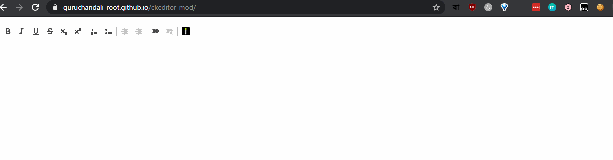

## This repository contains modifications to ckeditor to suit guruchandali's editing purposes

#### Demo: https://guruchandali-root.github.io/ckeditor-mod/

### Working

Upload an image using CKEditor's inbuilt button and it will transparently host an image off-site and load it in the editor.

### Setting it up

You will need the api key. Head over to imgur to access yoru API key: https://apidocs.imgur.com/.
The API key goes in config.js. Look at line 6-15.

### To-Do

- Drag and drop support
- Add Google Keyboard inout method

## Contribution Guidline

- Fork the repo
- Send a PR
- Be sure to modify index.html to have a working demo of your modification/usecase

Once your PR has been merged, the demo webpage should automatically be updated with your code change.